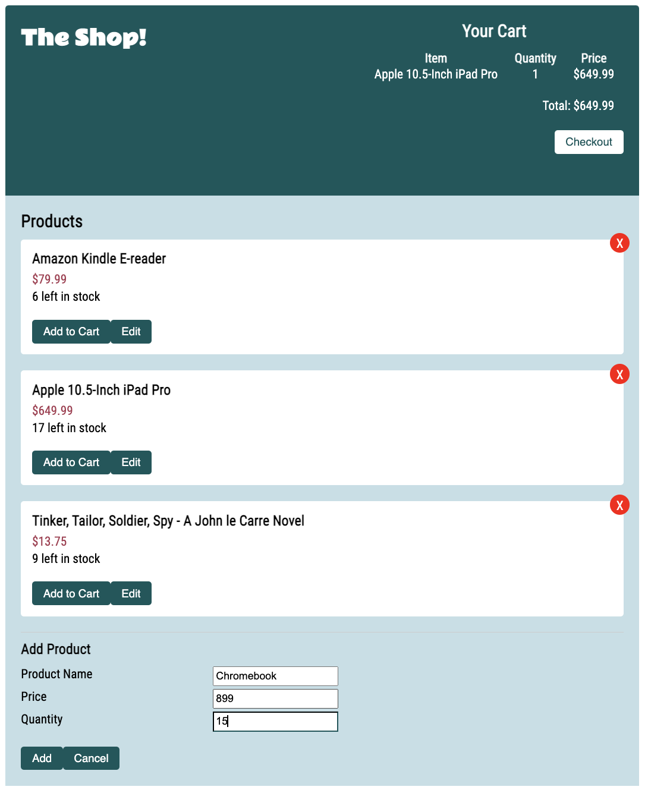

# Shopping Cart App

## Background
The purpose of building this application was to become familiar with React, Redux, and Redux Toolkit. Please see individual branches within the Github repo for the different variations. 

## Database Setup and Docker Local Deployment 
This process will spin up the shopping-cart application locally on your own machine, using Docker. 

1. Create mongoDB account - https://account.mongodb.com/account/register
2. Go to `collections` and create a new database (shopping_cart) with two collections `products` and `cartitems`. 
3. Under Security tab, click Database Access, and on the right `add new database user`. After you enter username and password, click `add user` at the bottom right corner.
4. Under Security tab, click Network Access, and whitelist your IP address.
5. Once your cluster is created, under Clusters tab, click connect and copy the connection string which will look something like this `mongodb+srv://<username>:<password>@cluster0-zamyu.mongodb.net/<collection_name>?retryWrites=true&w=majority`. Replace the username, password, and collection_name with the appropriate names. 
6. Save the 'server.yaml' file into a folder, which can be found in the main branch of this repository. Edit the 'server.yaml', replacing - `mongodb+srv://<username>:<password>@cluster0-zamyu.mongodb.net/<collection_name>?retryWrites=true&w=majority` with your mongoDB connection string. 
7. Run the command `docker-compose -f shopping-cart.yaml up` and the shopping-cart application will be available for you on Port 3000 of your machine. 

## Sample Display
Here is a sample of what the finished product looks like

### **Add Product Display**

 

### **Edit Product Display**

 

### **Cart Header Display**

 
