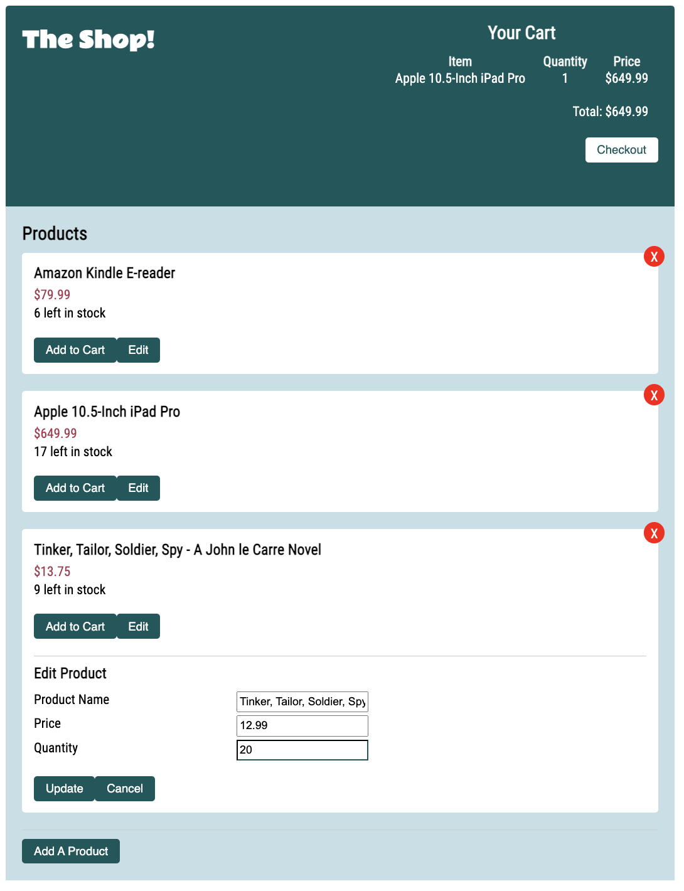

# Shopping Cart App

## Background
The purpose of building this application was to become familiar with React, Redux, and Redux Toolkit. Please see individual branches within the Github repo for the different variations. See the Instructions for how detail into how this application was created.

## Sample Display
Here is a sample of what the finished product looks like

### **Add Product Display**

 

### **Edit Product Display**

 

### **Cart Header Display**

 
